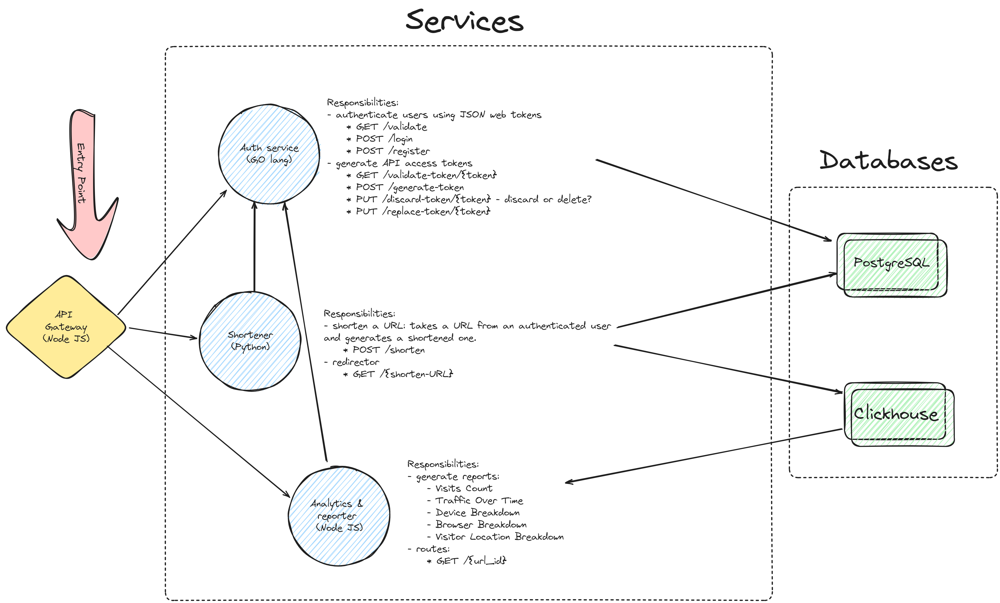

# Clicky-Metrics: A Microservices Learning Playground

Clicky-Metrics isn't your average URL shortener with bells and whistles. It's a dedicated learning environment designed with one primary motive: to provide a fun and practical playground for exploring microservices architecture.

## Focus on Learning:

Here, the emphasis is on experimentation and gaining hands-on experience with microservices concepts. Shortened URLs and click tracking serve as the engaging context for us to delve into the world of microservices.

## Initial architecture

